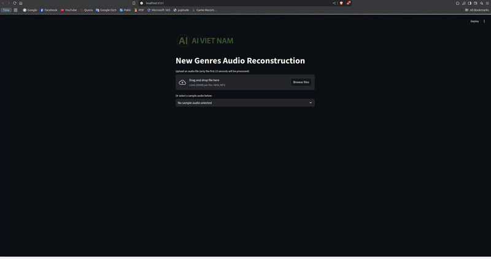
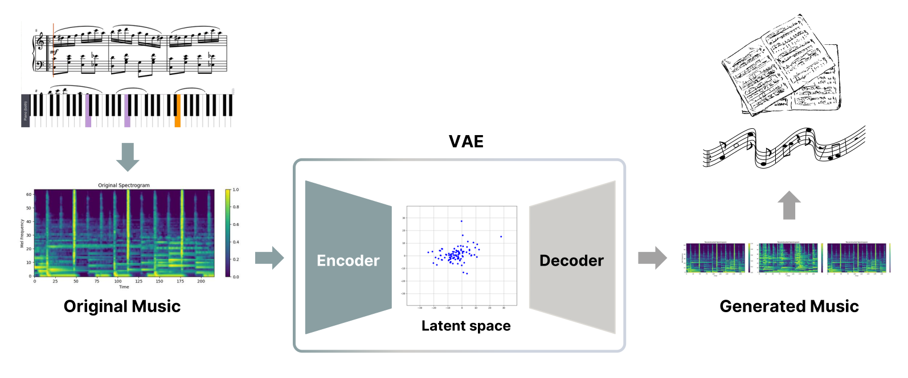
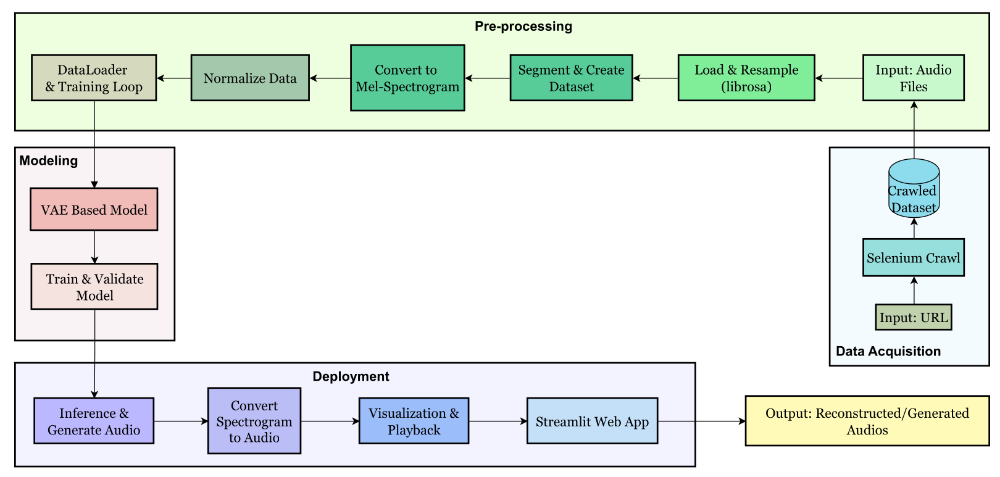

# Music Gen Project



## Overview
This project implements a Conditional Variational Autoencoder (CVAE) for audio processing and music generation. The model converts audio signals into Mel Spectrograms, conditions them on genre information, and reconstructs the audio using the Griffin-Lim algorithm.
### Illustrations:
-   
  *Illustration of the music generation problem based on a given musical sample.*

-   
  *Project overview pipeline.*
## Features
- **Audio Preprocessing:** Load, resample, and convert audio signals to Mel Spectrograms.
- **Normalization:** Normalize and denormalize Mel Spectrograms.
- **CVAE Model:** A conditional VAE that leverages genre labels for reconstruction.
- **Training & Inference:** Modules for model training and inference.
- **Visualization:** Display spectrograms and training loss curves.

## Project Structure
```
Instrumental-Music-Generation/
├── README.md
├── requirements.txt
├── main.py
└── music_gen/
    ├── __init__.py
    ├── audio_utils.py
    ├── data.py
    ├── models.py
    ├── train.py
    └── inference.py
└── notebooks
    └── instrumental-music-generation.ipynb

```

## Installation

1. Clone the repository:
   ```bash
   git clone https://github.com/NguyenHuy190303/Instrumental-Music-Generation.git IMG
   cd IMG
   ```
2. Create and activate a Conda environment:
   ```bash
   conda create -n music_gen python=3.10 -y
   conda activate music_gen
   ```
3. Install the required packages:
   ```bash
   pip install -r requirements.txt
   ```

## Usage
To train the model and run inference, simply execute:
```bash
python main.py
```

## Requirements
- Python 3.x
- PyTorch
- torchaudio
- librosa
- scikit-learn
- matplotlib
- tqdm
- IPython


# Acknowledgment
I would like to express my sincere gratitude to AI Vietnam, as well as to all the TAs and mentors who have guided and supported me throughout the completion of this project.
